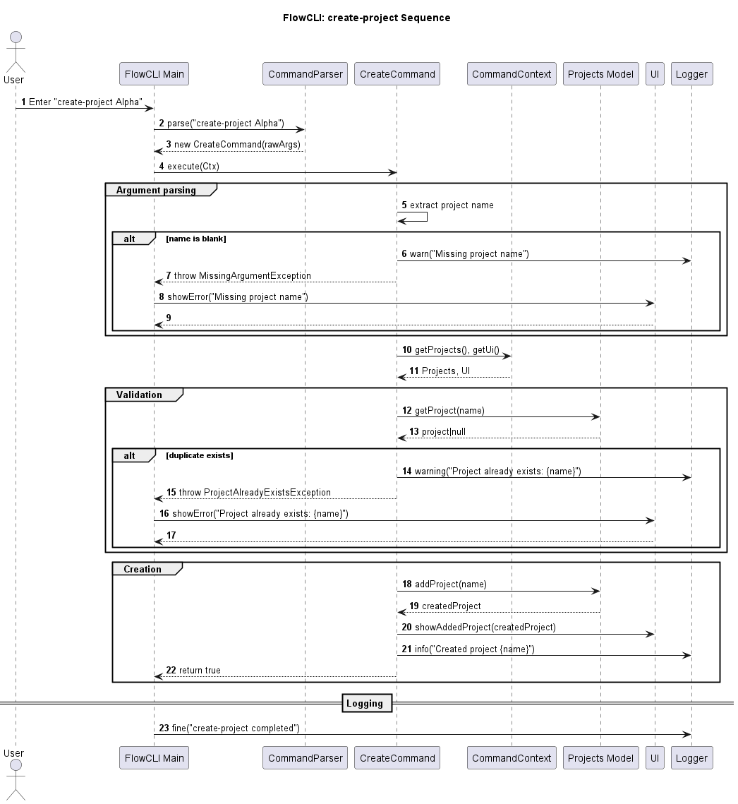

# Developer Guide

## Acknowledgements

{list here sources of all reused/adapted ideas, code, documentation, and third-party libraries -- include links to the original source as well}

## Design & implementation

{Describe the design and implementation of the product. Use UML diagrams and short code snippets where applicable.}

### CreateCommand feature by [Xylon Chan](team/xylonchan.md)

The `Create-project` command is facilitated by `ProjectList`and it is accessed by `CommandContext`. It extends `Command` with the feature of reading the user's project name input and creating a project entity.
Additionally , it implements the following operations:
- `ProjectList#getProject(String name)` - returns the project if it exists, or `null` if not found.
- `ProjectList#addProject(String name)` - adds a new project with the given name.
- `ConsoleUi#showAddedProject()` - notifies the user after successful creation.
- `CommandContext#getProjects()` - returns all the projects currently in the ProjectList

Given below is an example usage scenario and how the `create-project` feature behaves at each step

**User Input**: The user enters the `create-project` command with the project name (e.g., `create-project Alpha`).

**Parsing**: The CommandParser identifies the command as `create-project` and constructs a CreateCommand with the raw arguments.

**Execution**: The FlowCLI main loop invokes CreateCommand#execute(CommandContext). (Note: CreateCommand extends Command.)

**Argument Parsing**: Inside execute, CreateCommand extracts the project name from the arguments 

**Validation**: The command validates that the name is non-blank; if blank, it throws `MissingArgumentException`. It then checks duplicates via `context.getProjects().getProject(name)` if present, it throws `ProjectAlreadyExistsException`.

**Creating the Project**: On success, the command calls `context.getProjects().addProject(name)` to persist the new project in the model.

**UI Feedback**: The command obtains the UI via context.getUi() and calls showAddedProject() (or the equivalent success method) to confirm creation to the user.

**Return/Logging**: The command returns true to signal success and logs at info/fine levels; failures log at warning and do not mutate the model.

Here is a sequence diagram illustrating the process:

## Common Classes
### Project and ProjectList classes

### Project class 
# Overview 
Represents a single project and encapsulates its name and task collection `TaskList`. Allows for adding/updatig/deleting tasks within a project without directly coordinating multiple lower-level classes.

# Requirements 
`projectName` is non null and should be non-blank when constructed 
`projectTasks` is non null after construction 

# Helping classes
- `TaskList` and `Task` (for managing per-project tasks).

-`ProjectList (container)` creates and returns Project instances.

# API
- `Project(String projectName)` — Constructor that constructs an empty project with the given name.

- `String getProjectName()` — returns the name of the project.

- `TaskList getProjectTasks()` — returns the tasks in that project 

- `void addTask(String description)` — adds a task.

- `void addTask(String description, LocalDate deadline, int priority)` — add a task with deadline and priority

- `Task deleteTask(int index) — remove and return the task at index.`

- `Task updateTask(int index, String newDescription, boolean updateDescription, LocalDate newDeadline, boolean updateDeadline, Integer newPriority, boolean updatePriority)` — Updates the task description , deadline and priority 

- `String showAllTasks()` — render the project’s tasks to a printable string (delegates to `TaskList.render()`).

- `String toString()` — printable representation of the project header + rendered tasks. 

### ProjectList class 
# Overview 
An ArrayList container of Project instances offering indexed access, name-lookup, and simple rendering. This is the central point for commands to manipuate the collection of projects (e.g., create-project, delete-project, list-projects).

# Requirements  
`projects` is non null after construction 

# Helping classes
- `Project` - element sotred in the list.

# API
- `void addProject(String projectName)` — appends a new Project.

- `Project delete(int zeroBasedIndex)` — delete by index, return the removed Project for confirmation.

- `Project deleteProject(Project project)` — remove by identity and returns the removed project

- `Project getProjectByIndex(int zeroBasedIndex)` — indexed accessor.

- `List<Project> getProjectList()` — list the projects by name currently in the list

- `int getProjectListSize()` — returns the number of projects.

- `Project getProject(String projectName)` — returns the project via name-based lookup

- `String render()` — concatenate each project’s toString() into a printable block.

## Product scope
### Target user profile

{Describe the target user profile}

### Value proposition

{Describe the value proposition: what problem does it solve?}

## User Stories

|Version| As a ... | I want to ... | So that I can ...|
|--------|----------|---------------|------------------|
|v1.0|new user|see usage instructions|refer to them when I forget how to use the application|
|v2.0|user|find a to-do item by name|locate a to-do without having to go through the entire list|

## Non-Functional Requirements

{Give non-functional requirements}

## Glossary

* *glossary item* - Definition

## Instructions for manual testing

{Give instructions on how to do a manual product testing e.g., how to load sample data to be used for testing}
